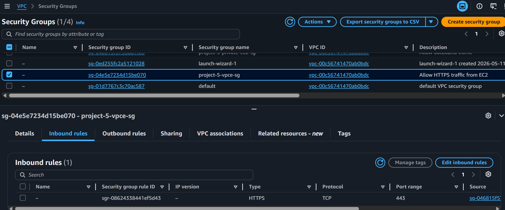
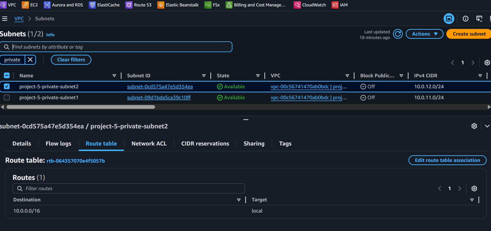
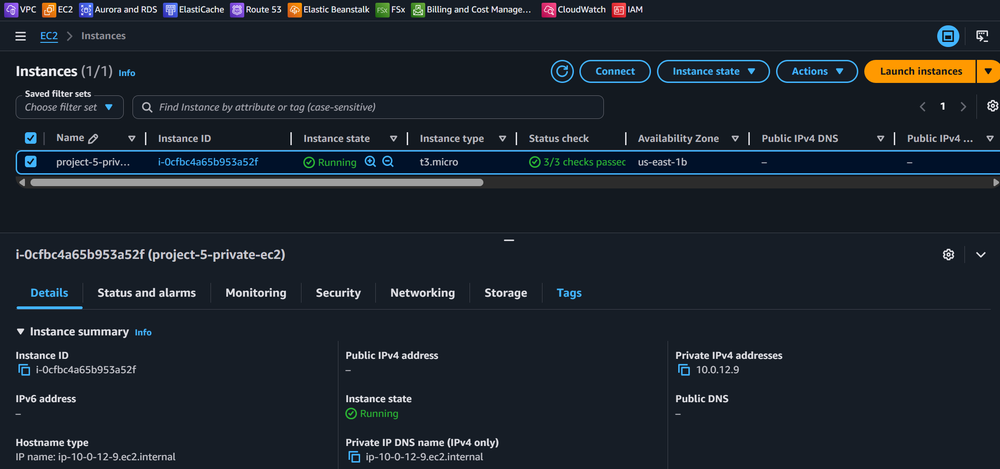
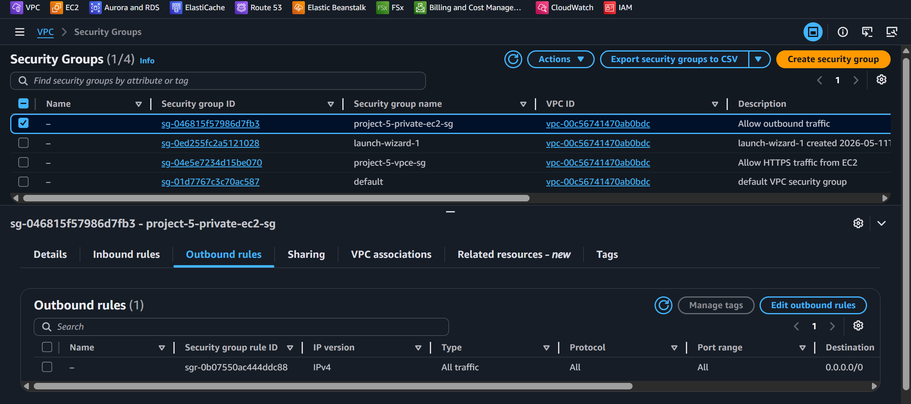
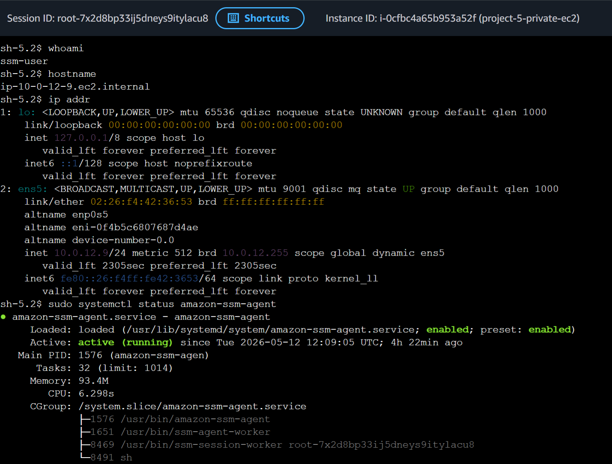
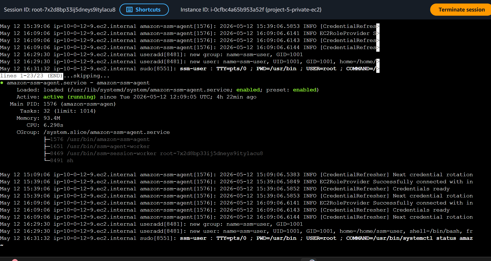
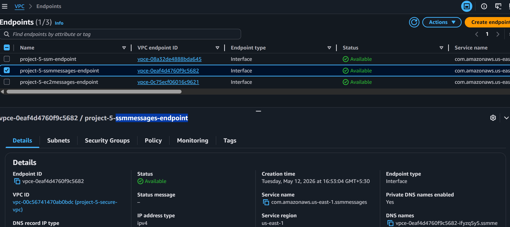
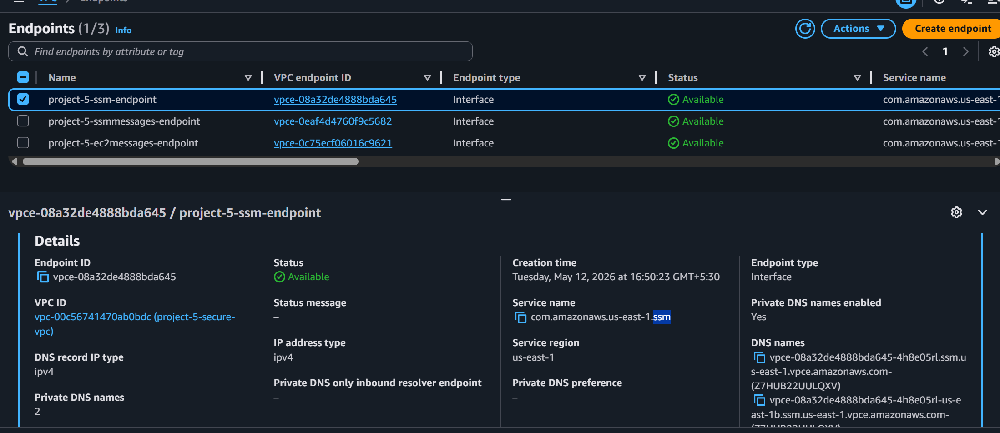
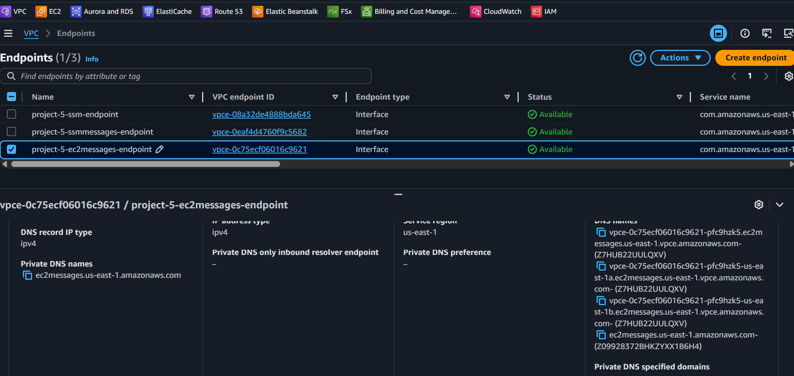

# Project 5 — Secure Private AWS Infrastructure using Session Manager, VPC Endpoints, and KMS Encryption

## Project Overview

This project demonstrates the implementation of a secure private AWS infrastructure designed around modern cloud security and administration best practices.

The architecture eliminates the need for:
- public EC2 instances
- SSH access
- bastion hosts
- publicly exposed management ports

Instead, administrative access is provided securely through AWS Systems Manager Session Manager using VPC Interface Endpoints and IAM-based authentication.

The project also implements:
- centralized session logging
- KMS-encrypted CloudWatch logs
- VPC Flow Logs for network visibility
- private subnet isolation
- secure AWS service communication without internet dependency

## Architecture Design

flowchart TB
    User[User / Cloud Engineer]
    IAM[AWS IAM Authentication]
    SSM[AWS Systems Manager Session Manager]

    subgraph AWS[AWS Cloud]
        subgraph VPC[VPC: project-5-secure-vpc CIDR: 10.0.0.0/16]

            subgraph Public[Public Subnets]
                IGW[Internet Gateway No public EC2 / No Bastion Host]
            end

            subgraph Private[Private Subnets]
                EC2[Private EC2 Instance No Public IP No SSH / Port 22 Closed]
                EP1[SSM Interface Endpoint]
                EP2[SSMMessages Interface Endpoint]
                EP3[EC2Messages Interface Endpoint]
            end

            CW[CloudWatch Logs Session Logs]
            KMS[AWS KMS Customer Managed Key]
        end
    end

    User --> IAM
    IAM --> SSM
    SSM --> EP1
    SSM --> EP2
    SSM --> EP3
    EP1 --> EC2
    EP2 --> EC2
    EP3 --> EC2

    EC2 --> CW
    CW --> KMS

The infrastructure was designed using a private subnet architecture to reduce public exposure and follow least-privilege networking principles.

The EC2 instance was deployed without a public IP address and without inbound SSH access. Instead of using traditional SSH or bastion hosts, administrative access is handled through AWS Systems Manager Session Manager.

To avoid dependency on internet routing and NAT Gateways for Systems Manager communication, Interface VPC Endpoints were configured for:
- SSM
- SSMMessages
- EC2Messages

This allows the EC2 instance to communicate privately with AWS Systems Manager services through the AWS backbone network.

### Architecture Highlights

- EC2 instance is deployed in a private subnet with no public IPv4 address.
- No SSH access, no port 22, and no bastion host are used.
- Administrative access is handled through AWS Systems Manager Session Manager.
- SSM communication uses VPC Interface Endpoints instead of public internet access.
- Session logs are sent to CloudWatch Logs.
- CloudWatch Logs are encrypted using an AWS KMS customer-managed key.
- This design reduces public exposure and follows a more secure cloud administration model.

## Security Features

- EC2 instances deployed in private subnets only
- No public IPv4 addresses assigned
- No inbound SSH access
- No bastion host required
- IAM-based administrative access
- Session Manager centralized logging enabled
- CloudWatch Logs encrypted using AWS KMS
- VPC Interface Endpoints configured for private AWS service communication
- VPC Flow Logs enabled for network visibility and monitoring

## Networking Design

| Component | Configuration |
|---|---|
| VPC CIDR | 10.0.0.0/16 |
| Public Subnet 1 | 10.0.1.0/24 |
| Public Subnet 2 | 10.0.2.0/24 |
| Private Subnet 1 | 10.0.11.0/24 |
| Private Subnet 2 | 10.0.12.0/24 |
| Internet Access | Removed for private workloads |
| Administrative Access | Session Manager |
| SSH Access | Disabled |

## Technologies Used

- AWS VPC
- EC2
- IAM
- AWS Systems Manager
- Session Manager
- VPC Interface Endpoints
- CloudWatch Logs
- AWS KMS
- VPC Flow Logs
- Amazon Linux 2023

## Validation Performed

- Verified EC2 instance had no public IP address
- Confirmed Session Manager connectivity without SSH
- Tested private AWS service communication using VPC endpoints
- Validated CloudWatch centralized session logging
- Verified KMS encryption on log groups
- Confirmed outbound internet restrictions after NAT removal

## Challenges & Lessons Learned

During implementation, several KMS permission and CloudWatch integration issues were encountered while configuring encrypted session logging.

This project improved understanding of:
- AWS KMS key policies
- service principals
- IAM trust relationships
- VPC endpoint communication
- Session Manager architecture
- centralized audit logging

## Screenshots

### VPC Architecture

### Private EC2 Configuration

### Session Manager Access

### VPC Endpoints

### KMS-Encrypted CloudWatch Logs
### Session Logs
### VPC Flow Logs